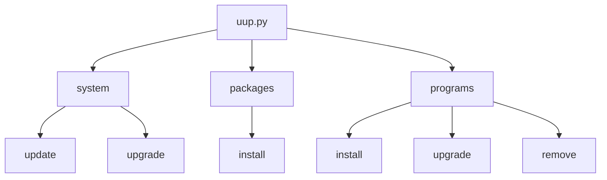

# Ubuntu Update Packages System (UUP System)

[](#)

- Update System
- Install Packages in self list
- Install, Update & Remove Programs in self list

## Usage

### Help commands
```bash
python uup.py -h
python uup.py [system|sys] -h
python uup.py [packages|pack] -h
python uup.py [programs|prog] -h
```

> All the commands for update, install or remove you must perform with `sudo` permission.

### Update System

Standart commands for update unix-system.

```bash
sudo python uup.py system
or
sudo python uup.py sys
```

### Install Packages in Self List

Install first-packages & libs for normal install and work other programs.  

```bash
sudo python uup.py packages
or
sudo python uup.py pack
```

You can edit list in `settings.py`  this:
```python
packages_list = [
	{'name': 'python-dev python3-dev'},
	{'name': 'libz-dev'}
	...
]
```
Every dict will convert to the install with `apt-get` and use `-y` flag [manual](https://linux.die.net/man/8/apt-get).
Example:
```bash
apt-get install -y python-dev python3-dev
apt-get install -y libz-dev
```

### Install Programs in Self List

#### Install ALL programs: 
```bash
sudo python uup.py programs
or
sudo python uup.py prog
```
You can edit list in `settings.py`  this:
>Required kays for example 1: **name**
>Required kays for example 2: **install** & **remove**
```python
programs_list = [
	{'name': 'mc'},
	
	{'short_name': 'sublime',
	 'name': 'sublime-text-installer',
	 'repo': 'ppa:webupd8team/sublime-text-3'},
	 
	{'name': 'slack',  
	 'install': [  
	    {'cmd': 'snap install slack --classic',
	     'warning_code': 0}  
	 ],  
	 'remove': [  
	    {'cmd': 'snap remove slack'}  
	]},
	...
	...
	# example 1
	{
		'short_name': 'short name programs for self',
		'name': 'name programs for install',
		'repo': 'add repository for install',
		 
		# commands list befor install programs
		'before': [
			{
			    'cmd': 'commands',
			    'warning_code': 0   # skip returned cmd code 
		    },
		    ...
		],
		
		# dependence programs list for work this program
		'dep': [
			# recursion method for install programs
			{'name': '...',  
			 'repo': '...',  
			 'before': [  
			     ...  
			 ]},
			 ...
		],
		
		# commands after install program
		'after': [
			{'cmd': '...'},
			...
		],		
	},

	 ...
	 # example 2 (other install without apt-get) 
	{
		'name': 'name programs',
		# command list for install programs  
		'install': [
			{'cmd': 'cmd'},
			...
		],  
		# command list for remove programs
		'remove': [
			{'cmd': 'cmd'},
			...
		]
	}
	
]
```

#### Update ALL program: 

For update all programs use flag `-u` or `--upgrade`.
```bash
sudo python uup.py prog -u
```

#### Install ONE program: 

For install one program use flag `-p` and name from list programs.
```bash
sudo python uup.py prog -p prog_name
```
> *prog_name* - short_name or name in programs list

#### Update ONE program: 

For update one program use flag `-p` and `-u` together.
```bash
sudo python uup.py prog -p prog_name -u
```
> *prog_name* - short_name or name in programs list

#### Remove ONE program: 

For remove one program use flag `-p` and `-r` or `--remove` together.
```bash
sudo python uup.py prog -p prog_name -r
```
> *prog_name* - short_name or name in programs list


## UML diagrams Menu


